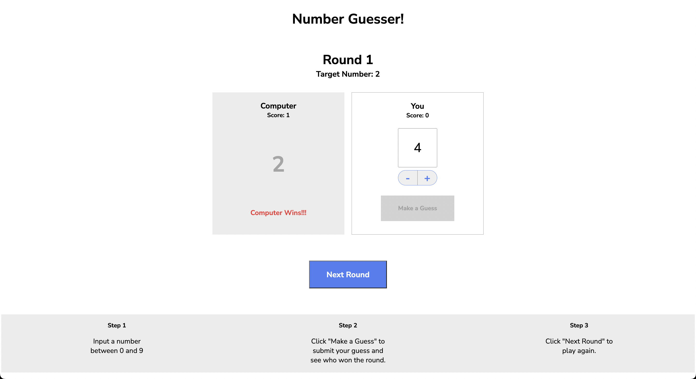
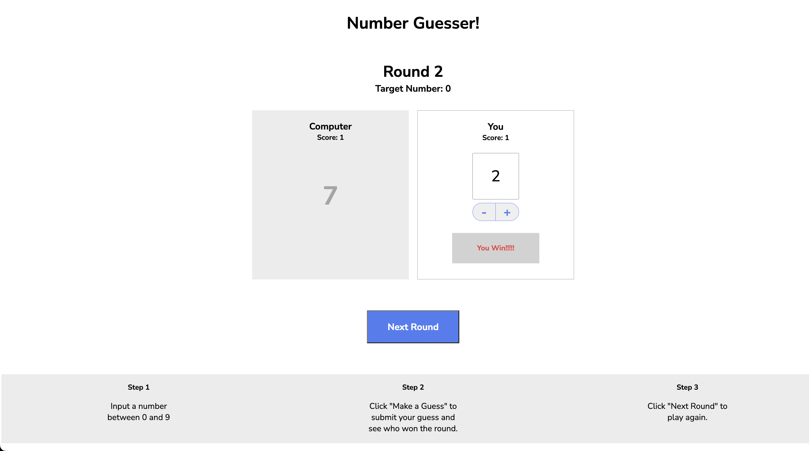

# Challenge Project: Number Guesser
## Overview
This project is slightly different from others you have encountered thus far on Codecademy. Instead of a step-by-step tutorial, this project contains a series of open-ended requirements which describe the project you’ll be building. There are many possible ways to correctly fulfill all of these requirements, and you should expect to use Codecademy, the internet, and other resources when you encounter a problem that you cannot easily solve. In order to complete this project, you should have completed the first three sections of Introduction to JavaScript through Learn JavaScript: Functions.

## Project Goals
In this project, you’ll write JavaScript functions to power a small guessing game. Your code will run in the browser instead of the terminal, and you can use your browser’s console to help you test your functions and view any syntax errors.

## Project Requirements
In this project, you’ll write four functions in script.js. We’ve provided some additional JavaScript code in game.js that will call your functions based on user interactions, but you don’t need to look at game.js and shouldn’t edit it if you want your project to work as intended. As you complete this project, make sure that all of your functions are named exactly as specified within these tasks so that they can be called correctly when the game is played. In this project, your JavaScript functions are incorporated into a website that also uses HTML/CSS. You’ll learn more about how to do this from scratch as you continue your JavaScript journey. Explore the completed version of the project to get a sense of what you’ll be building.

<!-- Results -->

## Output Image 

### User Interface 

### Game play

